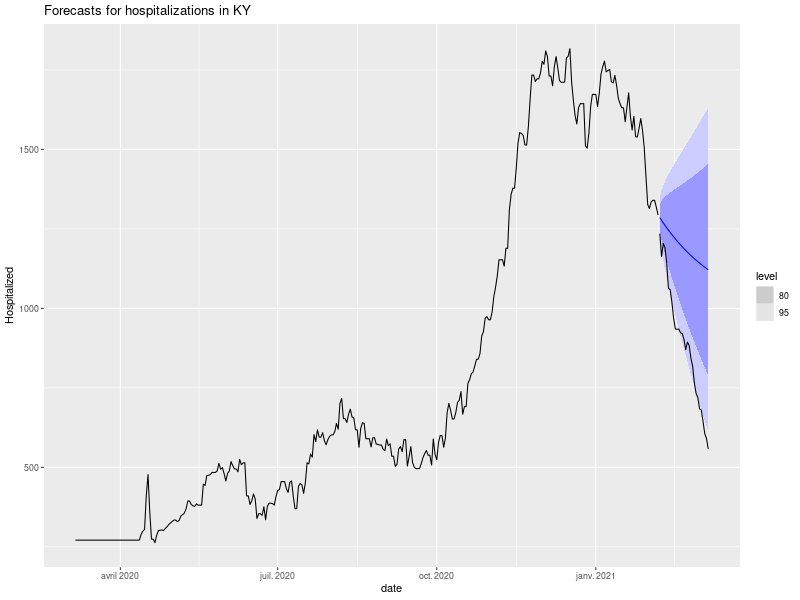

```{r setup, include=FALSE}
knitr::opts_chunk$set(echo = TRUE)
```
## Introduction

In this markdown, we will present some ideas to propose time series forecast in R.
To illustrate the methods we will be using, we will focus on the use of COVID tracking data, available on [covidtracking.com](https://covidtracking.com/data). This dataset presents various numbers related to COVID, such as the number of death, hospitalizations or tests, for each state of the United States. From this data, our objective will be to propose and evaluate methods, that would be able to forecast the evolution of the number of currently hospitalized people, in a given state.

## Importing libraries

```{r libraries, message=FALSE}
library(tidyverse)
library(finalfit)
library(broom)
library(tsibble)
library(fable)
library(feasts)
library(forecast)
library(MLmetrics)
library(reshape2)
library(nnfor)
library(imputeTS)
```

## Loading the dataset

The first step we need to follow is the loading of the data. To do so, we will extract it from a csv file, and put it into the variable `data`.
Once this is done, we can use the missing_glimpse function, from the `finalfit` library, that allows us to visualize the different columns composing our dataset, their type (continuous or categorical) and the number of missing values for each column.
Here, to illustrate our results, we will focus on data related to the state of Colorado. For this reason, we will create another variable  `data_co` containing the data that interests us.
```{r cars}
data <- read_csv("data.csv")
missing_glimpse(data)

data_co <- as_tsibble(data %>% filter(state=="CO"), index = date)
data_co$hospitalizedCurrently <- na.interp(data_co$hospitalizedCurrently)
```
Once the data is prepared, a first idea would be to plot it.
```{r plot, message=FALSE}
data_co %>% ggplot(aes(x = date, y = hospitalizedCurrently))+
  geom_line()+  ggtitle('Currently hospitalized people versus the date')+
  xlab('Date')+
  ylab('Number of currently hospitalized people')
```

In this document, we will be training forecasting models and evaluating them. To do so, we decided to consider two subsets of our data, to compose a training set and a test set. Here, the training set will contain all samples that were registered from 06/03/2020 to 06/02/2021, while the test set will contain samples from 07/02/2021 to 03/04/2021.

```{r train_test, message=FALSE}
train <- data_co %>%
  filter_index("2020-03-06" ~ "2021-02-06")

test <- data_co %>%
  filter_index("2021-02-07" ~ .)

ggplot()+
  geom_line(data = train, aes(x = date, y = hospitalizedCurrently, colour = 'red'))+
  geom_line(data = test, aes(x = date, y = hospitalizedCurrently, colour = 'darkblue'))+
    scale_color_discrete(name = "Subset", labels = c("Test", "Training"))

```

## Simple forecasting methods

In this document, we will study different forecasting methods, starting with simple ones. 
Forecasting can indeed be performed by analyzing the shape of a curve. To do so we can imagine several ideas:

* Average: the value returned as a forecast will be the mean value of the training sample.
* Naive: the value returned as a forecast will be the last value of the training sample.
* Seasonal Naive: the forecast will be set to the last season values.

```{r pressure}

train <- data_co %>%
  filter_index("2020-03-06" ~ "2021-02-06")

hospitalized_fit <- train %>%
  model(
    Mean = MEAN(hospitalizedCurrently),
    `Naïve` = NAIVE(hospitalizedCurrently),
    `Seasonal naïve` = SNAIVE(hospitalizedCurrently)
  )

# Generate forecasts for 20 days
hospitalized_fc <- hospitalized_fit %>% forecast(h = 30)

hospitalized_fc %>%
  autoplot(train, level = NULL) +
  autolayer(
    filter_index(data_co, "2021-02-07" ~ .),
    .vars = hospitalizedCurrently,
    colour = "black"
  ) +
  labs(
    x = "Date",
    y = "Hospitalized",
    title = "Forecasts for hospitalizations"
  ) +
  guides(colour = guide_legend(title = "Forecast"))

```

As we could imagine, these simple models don't seem to fit properly our initial distribution. According to the precision we need on our prediction, such models can sometimes give us a good sense of scale of what we should expect. However, in most of the cases, they will appear to be too simple to describe our data and will need to be improve in order to get a more satisfactory forecast.
To improve our models, we can first visualize the residuals for each model, which simply corresponds to the difference between the observed values and the predicted one.

```{r residual naive}

aug <- data_co %>%
  model(
    Mean = MEAN(hospitalizedCurrently),
    `Naïve` = NAIVE(hospitalizedCurrently),
    `Seasonal naïve` = SNAIVE(hospitalizedCurrently)
  ) %>% 
  augment()

autoplot(aug, .innov) +
  labs(x = "Date",
       y = "Hospitalized",
       title = "Residuals")+
  guides(colour = guide_legend(title = "Forecast"))
   
```

In our example, it seems that the naive method presents the best results, as the residuals are closer to zero than for the other methods. However, the visual information is not sufficient to evaluate the quality of our forecasting. For the following, we will still focus on the naive method, and try to propose some improvements.

```{r naive graphs, message = FALSE}
data_co %>% 
  model(NAIVE(hospitalizedCurrently)) %>% 
  gg_tsresiduals()
```

If we assume that the distribution of the possible future values follows a normal distribution, we can now propose confidence intervals on our predictions. Here, we propose to visualize 80% and 95% confidence intervals and compare it with your observed data. We can assume that our confidence intervals may be inaccurate, as the normal distribution assumption may not be very appropriate, regarding the histogram of the residuals.

```{r interval naive, message = FALSE}
train %>%
  model(NAIVE(hospitalizedCurrently)) %>%
  forecast(h = 30) %>%
  hilo()

train %>%
  model(NAIVE(hospitalizedCurrently)) %>%
  forecast(h = 30) %>%
  autoplot(train) +
  autolayer(
    filter_index(data_co, "2021-02-07" ~ .),
    .vars = hospitalizedCurrently,
    colour = "black"
  ) +
  labs(title="Forecasts for hospitalizations", y="Hospitalized" )
```

In our case, naive method allows us to produce quite reliable confidence intervals, as all observed values are in the 80% interval. However, the predicted value struggle to fit the real evolution of hospitalization. We will try to improve our results, experimenting other models.

## Exponential smoothing methods

```{r ETS}
data_co %>%
  stretch_tsibble(.init = 10) %>%
  model(
    SES = ETS(hospitalizedCurrently ~ error("A") + trend("N") + season("N")),
    Holt = ETS(hospitalizedCurrently ~ error("A") + trend("A") + season("N")),
    Damped = ETS(hospitalizedCurrently ~ error("A") + trend("Ad") +
                   season("N"))
  ) %>%
  forecast(h = 1) %>%
  accuracy(data_co)
```

```{r Damped}
train %>%
  model(
    Damped = ETS(hospitalizedCurrently ~ error("A") + trend("Ad") +
                   season("N"))
  ) %>% 
  forecast(h = 30) %>%
  autoplot(train) +
  autolayer(
    filter_index(data_co, "2021-02-07" ~ .),
    .vars = hospitalizedCurrently,
    colour = "black"
  ) +
  labs(x="Date", y="Number currently hospitalized people",
       title = "Evolution of currently hospitalized people")
```

This method seems to produce satisfactory results, and represents quite well the trending evolution of the hospitalized people.
To evaluate more robustly our model, we can train it on other states, and compute the Mean Squared Error (MSE), for each forecast. Here, we will forecast over a period of about 30 days.

```{r all_states}
states <- levels(as.factor(data$state))

errors <- c()
errors_mean <- c()
not_na_states <- c()
  
for(st in states){
  data_state <- as_tsibble(data %>% filter(state==st), index = date)
  if(!all(is.na(data_state$hospitalizedCurrently))){
    data_state$hospitalizedCurrently <- na.interp(data_state$hospitalizedCurrently)

    not_na_states <- c(not_na_states, st)
    
    
    train <- data_state %>%
      filter_index("2020-03-06" ~ "2021-02-06")
    
    test <- data_state %>%
      filter_index("2021-02-07" ~ .)
    
    y <- test$hospitalizedCurrently
    trained_model <- train %>%
      model(ETS(hospitalizedCurrently ~ error("A") + trend("Ad") + season("N"))) %>%
      forecast(h = length(test$hospitalizedCurrently))
    y_hat <- pull(trained_model, '.mean')
    
    trained_model_mean <- train %>% 
      model(NAIVE(hospitalizedCurrently)) %>% 
      forecast(h = length(test$hospitalizedCurrently))
    y_hat_mean <- pull(trained_model_mean, '.mean')
    
    err <- MSE(y, y_hat)
    errors <- c(errors, err)
    
    err_mean <- MSE(y, y_hat_mean)
    errors_mean <- c(errors_mean, err_mean)
    
    png(filename=paste0("outputs/exp_graphs/hospitalizations",st,".png"),width=800,height=600) 
    plot <- trained_model %>%
      autoplot(train) +
      autolayer(
        test,
        .vars = hospitalizedCurrently,
        colour = "black"
      ) +
      labs(title=paste("Forecasts for hospitalizations in",st), y="Hospitalized" )
    print(plot)
    dev.off()
  }

}

df <- data.frame(not_na_states, errors, errors_mean)
names(df)[2] <- 'Exponential smoothing'
names(df)[3] <- 'Naive'

df_reduced <- df[c(10,11,16,18,19,20,21),]

df_reduced <- melt(df_reduced)
names(df_reduced)[3] <- "errors"

ggplot(df_reduced, aes(x = not_na_states, y= errors, fill = variable), xlab="Method") +
  geom_bar(stat="identity", width=.5, position = "dodge")  +
  ggtitle('MSE according states for each method') +
  xlab('state') +
  ylab('MSE')

```
Here, we can observe that the results presented on the selected states are indeed better than the one obtained using the naive method. However, we still can find cases where the forecast is not really representative of the evolution of hospitalizations. This happens mainly when we observed a sudden increase or decrease. This is actually the case for the state of Kentucky.



## Multi Layers Perceptron

In this section, we will try to implement a MLP, using the nnfor package.

```{r mlp init}

x <- ts(train$hospitalizedCurrently)
x <- ts(na_remove(x))

fit1 <- mlp(x)
plot(fit1)
```
This plot represents the MLP architecture that is being used to train our model.
We can change it, but we will leave this default parameterization for the first tests.
Using this model, we then can forecast the evolution of hospitalizations, for the state of Colorado first.

```{r CO frc}
frc <- predict(fit1, h=30)

plot(frc)
```

Now, in order to evaluate this new method, we will use the same method as previously, computing MSE for forecasting on each state, then comparing it to the results given by exponential smoothing.

```{r all states mlp}
errors_mlp <- c()

for(st in states){
  data_state <- as_tsibble(data %>% filter(state==st), index = date)
  if(!all(is.na(data_state$hospitalizedCurrently))){
    data_state$hospitalizedCurrently <- na.interp(data_state$hospitalizedCurrently)
    not_na_states <- c(not_na_states, st)
    
    if(st=="VI"){
      break
    }
    
    train <- data_state %>%
      filter_index("2020-03-06" ~ "2021-02-06")
    
    test <- data_state %>%
      filter_index("2021-02-07" ~ .)
    
    x <- ts(train$hospitalizedCurrently)
    x <- ts(na_remove(x))
    
    fit <- mlp(x)
    frc <- predict(fit, h=length(test$hospitalizedCurrently))
    
    y <- test$hospitalizedCurrently
    y_hat <- frc$mean
    
    err <- MSE(y, y_hat)
    errors_mlp <- c(errors_mlp, err)
    
    png(filename=paste0("outputs/mlp_graphs/hospitalizations",st,".png"),width=800,height=600) 
    plot(frc)
    dev.off()
  }
}
```

```{r mse plot}
df <- data.frame(head(not_na_states,48), head(errors,48), errors_mlp)
names(df)[2] <- 'Exponential smoothing'
names(df)[3] <- 'MLP'

df_reduced <- df[c(5,10,11,16,18,19,20,21),]

df_reduced <- melt(df_reduced)
names(df_reduced)[1] <- "not_na_states"
names(df_reduced)[3] <- "errors"

ggplot(df_reduced, aes(x = not_na_states, y= errors, fill = variable, xlab="Method")) +
  geom_bar(stat="identity", width=.5, position = "dodge")  +
  ggtitle('MSE according states for each method') +
  xlab('state') +
  ylab('MSE')
```